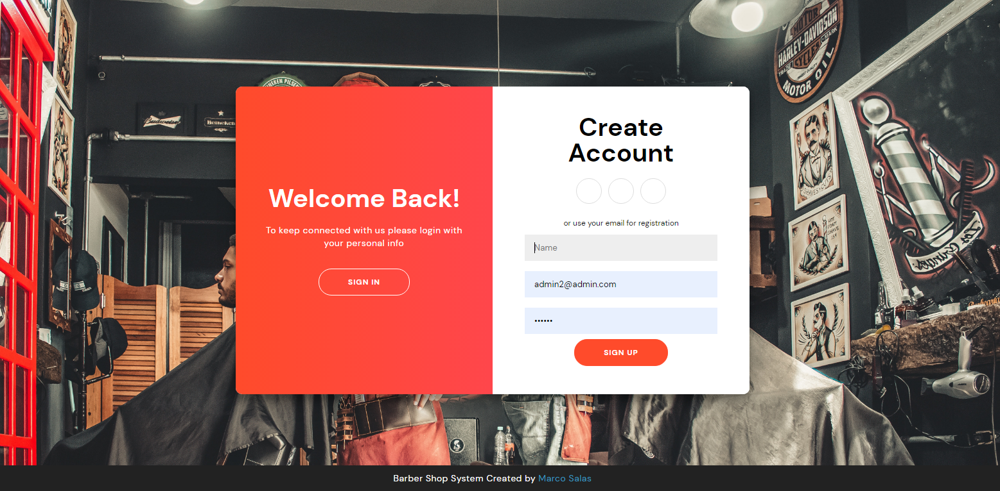
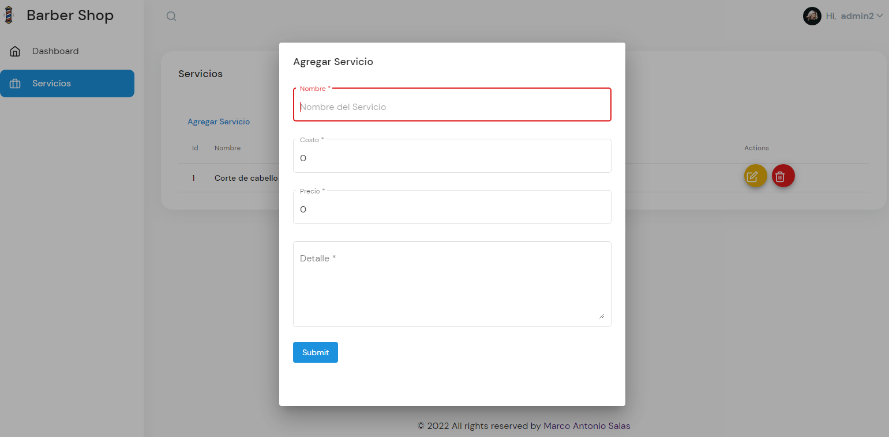
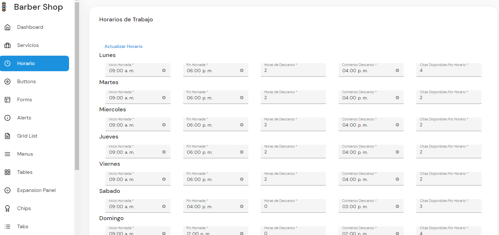
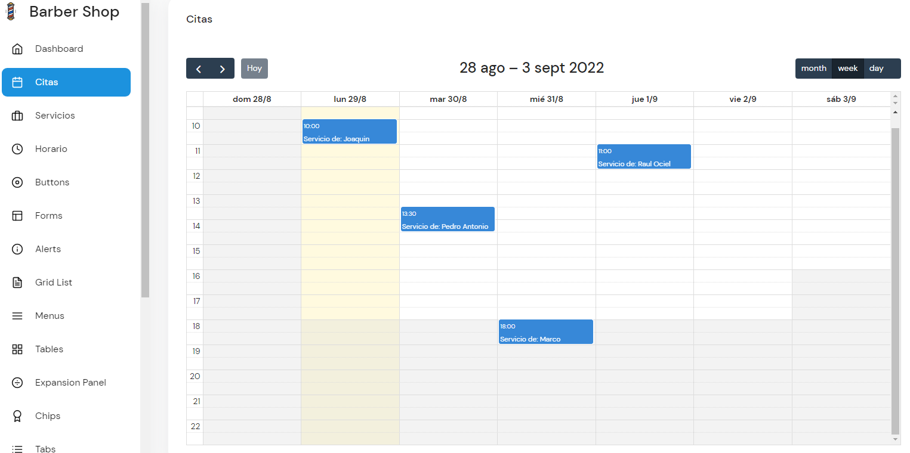

<!-- ## What's included in MaterialPro Angular 12 Lite [versions 7,8,9, and 10,11] -->

<!-- Heading of Template -->
<h1>
  Angular Barber Shop 
</h1>

<!-- Main image of Template -->
  

Sistema Barber Shop desarrollado en Angular 13.1.3 con el fin de controlar un negocio de barberia desde 
control administrativo, contable, servicios, productos y de citas. 

El sistema se encuentra en desarrollo las integraciones se harán poco a poco además que el software es de código libre . 

El backend es desarrollado en node Js y con base de datos en Mongo DB el backend se subira a otro repositorio en la siguiente liga Barber Backend: <a href="https://github.com/MarcoAntonioHerreraSalas/Backend-NodeJs-Angular-Barber-Shop">https://github.com/MarcoAntonioHerreraSalas/Backend-NodeJs-Angular-Barber-Shop </a>

Asi mismo el sistema trabaja con una version de Flexy Admin para facilitar el trabajo de admin panel se utilizo la version gratuita de libre uso.

## Que contiene la versión v2 Barber Shop System?

<ul>
<li>Login y Token de seguridad</li>
<li>Flexy Admin </li>
<li>Angular Guard para Inicio de Sesión</li>
<li>Modulo de Servicios con CRUD</li>
<li>Modulo de Agendar Citas</li>
</ul>

## Para descargar el sistema ejecutar en CMD 

`Git clone https://github.com/MarcoAntonioHerreraSalas/Angular-Barber-Shop.git `

Seguido de la descarga del repositorio ejecutar la siguiente línea para las dependencias ( Recuerda tener
la versión de Angular 13.1.3 ya instalada

`npm install`

## Development server

Run `ng serve` for a dev server. Navigate to `http://localhost:4200/`. The app will automatically reload if you change any of the source files.

<!-- Versions of Template -->
<h2>Versions</h2>
<table>
  <thead>
    <tr>
      <th>v1</th>
      <th>v1.2</th>
      <th>v1.3</th>
      <th>v1.4</th>
    </tr>
  </thead>
  <tbody>
    <tr>
      <td>
          
      </td>
      <td>
          
      </td>
      <td>
          
      </td>
      <td>
          
      </td>
    </tr>
  </tbody>
</table>

<!-- Resources of Template -->
<h2>Demos de la plantilla Admin que se utilizó</h2>
<ul>
<li>  
  Live Demo: <a href="https://demos.wrappixel.com/free-admin-templates/angular/flexy-angular-free/angular/ home" target="_blank" >https://demos.wrappixel.com/free-admin-templates/angular/flexy-angular-free/angular/home</a>
</li>
<li>
    Download Page: <a href="https://www.wrappixel.com/templates/flexy-angular-admin-free/" rel="nofollow">
  https://www.wrappixel.com/templates/flexy-angular-admin-free/</a>
</li>
</ul>

<!-- Licensing of Template -->
<h2>Licensing</h2>
<ul>
  <li>
    
Copyright 2022 Wrappixel (<a href="https://www.wrappixel.com/" rel="nofollow">https://www.wrappixel.com/</a>)

  </li>
  <li>
    
Licensed under MIT (<a href="https://www.wrappixel.com/license/">https://www.wrappixel.com/license/</a>)

  </li>
</ul>

<!-- ## License -->

<!-- MaterialPro Angular 12 Lite Template is released under MIT license. MaterialPro Angular Lite is Free angular 12 template designed and developed by WrapPixel. Please feel free to download it and use it for your personal as well as commercial projects. Also do not forgot to share it with your friends and colleagues. -->

## Versión completa pronto disponible

<!-- Social Media of Wrappixel -->
<h2>Social Media</h2>

Linkedin: <a href="https://mx.linkedin.com/in/marco-antonio-herrera-salas-ba5bb916b">https://mx.linkedin.com/in/marco-antonio-herrera-salas-ba5bb916b</a>

